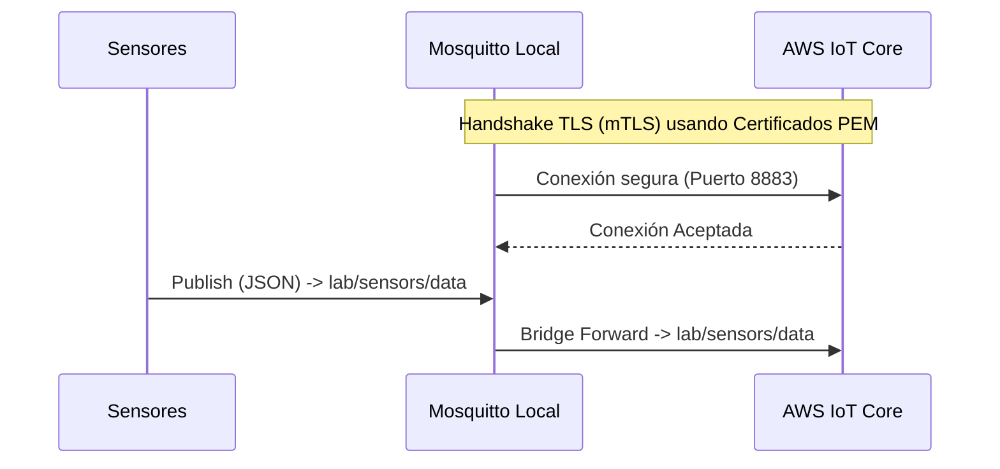
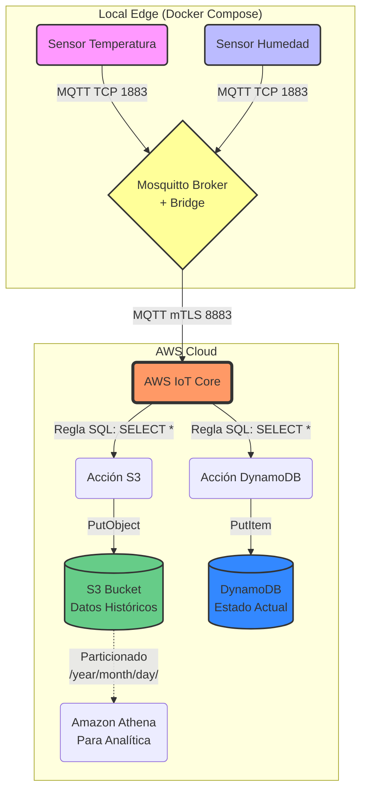

# Arquitectura y Flujo de Datos IoT

Este documento explica en detalle la arquitectura implementada tanto en el entorno local como en la nube de AWS, cómo interactúan sus componentes y el flujo de los datos desde que son generados hasta que son almacenados.

## 1. Arquitectura Local (Edge)

En el entorno local, simulamos un entorno de borde (Edge) utilizando contenedores gestionados por `docker-compose`.

- **Sensores (Python):** Se crearon contenedores que simulan dispositivos IoT (`sensor_temp_01` y `sensor_humidity_01`). Estos scripts en Python generan datos simulados (temperatura y humedad) y los publican regularmente a un broker MQTT local.
- **Edge Gateway (Mosquitto):** Un contenedor de [Eclipse Mosquitto](https://mosquitto.org/) actúa como el broker MQTT local. Recibe los mensajes de los sensores sin requerir autenticación compleja a nivel local, facilitando la interconexión en el sitio.

### El Bridge de Mosquitto
Mosquitto no solo sirve para recibir mensajes locales, sino que está configurado como un **Bridge** (puente). Su trabajo es tomar los mensajes publicados localmente en ciertos tópicos (ej. `lab/sensors/data`) y reenviarlos automáticamente hacia la nube (AWS IoT Core) de forma segura.

---

## 2. Seguridad y Certificados de AWS IoT Core

Para que Mosquitto (en local) pueda comunicarse con AWS IoT Core, la conexión debe ser extremadamente segura mediante **Autenticación Mutua TLS (mTLS)**.

### Conceptos Clave de Seguridad (Criptografía)
Para entender cómo funciona esta autenticación, es vital conocer estos 4 elementos fundamentales que utiliza AWS IoT Core:

1. **Clave Privada (Private Key):** Es el secreto más importante del dispositivo. Como su nombre indica, *nunca* debe compartirse ni viajar por internet. El dispositivo (Mosquitto) la usa para "firmar" criptográficamente sus mensajes y demostrar matemáticamente su identidad. Si alguien roba esta clave, puede hacerse pasar por tu dispositivo.
2. **Clave Pública (Public Key):** Es la pareja matemática de la clave privada. Esta clave sí puede compartirse libremente. AWS IoT Core la utiliza para verificar que las firmas digitales enviadas por el dispositivo realmente fueron creadas con la clave privada correspondiente.
3. **Certificado PEM (Client Certificate):** Es como un "pasaporte digital" o un documento de identidad para el dispositivo. Contiene la Clave Pública del dispositivo, su nombre (ID) y está "firmado" por una Autoridad Certificadora (en este caso, AWS). Este certificado viaja durante la conexión inicial (handshake TLS) para presentarse ante AWS IoT Core.
4. **Amazon Root CA (Certificate Authority):** Así como el dispositivo necesita demostrar quién es ante AWS, el dispositivo también necesita asegurarse de que realmente se está conectando a los servidores legítimos de Amazon y no a un atacante (previniendo ataques *Man in the Middle*). El Root CA es el certificado raíz de confianza de Amazon que nuestro Mosquitto local usa para verificar la autenticidad del servidor de AWS IoT Core.

### ¿Qué se hizo para tener los certificados en local?
1. **Generación con Terraform:** Durante el despliegue (`make aws-up`), Terraform solicita a AWS IoT Core la creación de un nuevo certificado (`aws_iot_certificate`).
2. **Descarga Automática:** Terraform guarda la clave privada, la clave pública, el certificado PEM y el Amazon Root CA en tu máquina local dentro de la carpeta `edge_gateway/certs/`.
3. **Inyección en Docker:** Creamos un `Dockerfile` a medida para Mosquitto que toma estos certificados y su configuración (`mosquitto.conf`) y los empaqueta dentro del contenedor de Mosquitto al momento de hacer el build.
4. **Política de IoT:** En AWS, Terraform crea una política estricta que solo permite a este certificado conectarse, publicar y suscribirse al tópico `lab/sensors/*`. Esta política se adjunta al certificado, y el certificado se asocia a un "Thing" (objeto virtual) que representa a nuestro Edge Gateway en la nube.

---

## 3. Infraestructura en AWS (Cloud)

Una vez que los mensajes llegan a la nube a través de la conexión puente segura, entran al **AWS IoT Core**, el cual actúa como el "router" principal.

### El Motor de Reglas (IoT Rules)
AWS IoT Core cuenta con un motor de reglas que evalúa cada mensaje entrante usando sintaxis SQL (ej. `SELECT * FROM 'lab/sensors/data'`). Dependiendo del tópico, el motor de reglas dispara acciones de forma paralela sin necesidad de servidores intermedios.

Hemos configurado dos reglas principales:

1. **Regla de S3 (Cold Data / Histórico):**
   - **Objetivo:** Guardar todos los eventos para analítica histórica a largo plazo (Big Data).
   - **Acción:** Cada mensaje es interceptado y guardado como un archivo JSON en un **Bucket de Amazon S3**.
   - **Estructura:** Se organizan automáticamente por particiones de tiempo (`year=.../month=.../day=...`), lo cual es una mejor práctica para poder consultarlos después usando Amazon Athena de forma eficiente.

2. **Regla de DynamoDB (Hot Data / Estado Actual):**
   - **Objetivo:** Mantener el estado más reciente de cada dispositivo para dashboards en tiempo real.
   - **Acción:** Inserta o actualiza el registro en una tabla de **Amazon DynamoDB**.

### Diseño de la Tabla en DynamoDB
La tabla `SensorData` fue diseñada con una característica muy específica en mente:
- Tiene **únicamente una Clave de Partición (Partition Key o Hash Key)** llamada `device_id`.
- **No tiene Clave de Ordenamiento (Sort Key).**

**¿Qué pasa cuando se mandan eventos a DynamoDB?**
Al no tener una Sort Key, la clave primaria es solo el ID del dispositivo. Cada vez que llega un nuevo evento (por ejemplo, del sensor `sensor-temp-01`), DynamoDB **sobrescribe** el registro anterior que tenía ese mismo ID. 
De esta forma, la tabla nunca crece infinitamente con el historial; simplemente actúa como un **"Device Twin"** o **"Device Shadow"**, manteniendo siempre la última temperatura o humedad conocida.

---

## 4. Diagrama Completo del Flujo de Datos

## Resumen del Flujo
1. Los sensores Python emiten datos en formato JSON cada X segundos.
2. Mosquitto recibe los datos localmente y los enruta automáticamente a AWS IoT Core usando una conexión encriptada y autenticada por certificados X.509 generados por Terraform.
3. AWS IoT Core procesa los datos en tiempo real mediante su motor de reglas.
4. El dato se bifurca:
   - Una copia actualiza el estado "en vivo" en DynamoDB (sobreescribiendo el valor anterior del mismo sensor).
   - Una copia se archiva permanentemente en S3 (acumulándose) para análisis futuro con Athena.
