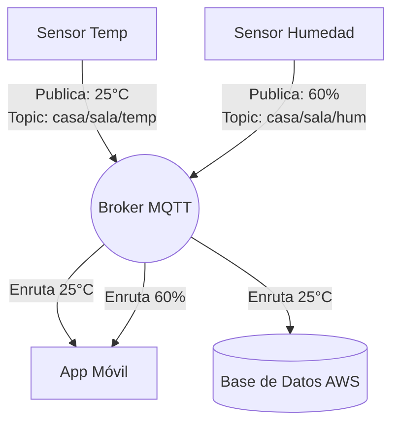

# Protocolo MQTT (Message Queuing Telemetry Transport)

## ¿Qué es MQTT?
MQTT es un protocolo de mensajería de publicación/suscripción (pub/sub) extremadamente ligero y eficiente, diseñado específicamente para redes con ancho de banda limitado, alta latencia y dispositivos con recursos de hardware restringidos. Es el estándar de facto para el Internet de las Cosas (IoT).

## Características Principales
- **Ligero y Eficiente:** Su cabecera mínima es de tan solo 2 bytes, lo que minimiza el consumo de red drásticamente frente a protocolos como HTTP.
- **Bajo Consumo de Batería:** Ideal para dispositivos remotos (como sensores a batería) porque mantiene conexiones abiertas con muy bajo costo computacional (Keep-Alive).
- **Fiabilidad (QoS - Quality of Service):** Garantiza la entrega de mensajes en tres niveles:
  - **QoS 0:** "A lo sumo una vez" (Dispara y olvida).
  - **QoS 1:** "Al menos una vez" (Garantiza llegada, pero pueden haber duplicados).
  - **QoS 2:** "Exactamente una vez" (La entrega más segura y lenta).
- **Retención de Mensajes (Retained Messages):** El broker puede guardar el último mensaje publicado en un tópico para entregárselo inmediatamente a cualquier cliente nuevo que se suscriba.
- **Testamento (Last Will and Testament - LWT):** Cuando un cliente se conecta al broker, puede registrar un "mensaje de testamento": un tópico y un payload que el broker **guardará en memoria pero NO publicará de inmediato**. Este mensaje solo será enviado automáticamente por el broker si el cliente se desconecta de forma **inesperada** (se cortó la luz, se cayó la red, el proceso crasheó). ¿Para qué sirve? Para que el resto del sistema se entere de que un dispositivo se murió y pueda reaccionar. Ejemplos:
  - Un sensor de temperatura en una finca deja de responder → El broker publica su LWT en `status/finca_norte/sensor_temp/t_01` con payload `{"status": "OFFLINE"}` → Un subscriber detecta el mensaje y genera una alerta de mantenimiento.
  - Un actuador se desconecta → El dashboard muestra inmediatamente que ese dispositivo está fuera de línea, sin necesidad de esperar un timeout largo.

## ¿Cómo Trabaja? El Modelo Pub/Sub
A diferencia del modelo Cliente-Servidor tradicional, MQTT utiliza un intermediario llamado **Broker**. Los dispositivos (Clientes) nunca se conectan directamente entre sí.
- **Publisher (Publicador):** Dispositivo que envía datos al broker etiquetados bajo un "Tópico".
- **Subscriber (Suscriptor):** Dispositivo o aplicación que se registra en el broker para recibir todos los mensajes de un tópico específico.
- **Broker:** El "router" central que recibe todos los mensajes y los distribuye a los suscriptores interesados.

## Modelos de Comunicación
- **Muchos a Uno (Telemetría):** Miles de sensores (muchos) publican datos individuales que son consolidados en un servidor central (uno). *Ejemplo: 10,000 medidores de luz en una ciudad enviando lecturas a una base de datos central.*
- **Uno a Muchos (Comandos / Broadcasting):** Un servidor central (uno) envía un comando que es recibido simultáneamente por miles de dispositivos (muchos). *Ejemplo: Un comando desde la nube para actualizar el firmware o apagar todas las luces de un edificio.*

## Estructura del Paquete MQTT
El paquete de red MQTT está altamente optimizado:
1. **Fixed Header (Cabecera Fija - 2 bytes min):** Contiene el tipo de paquete (CONNECT, PUBLISH, SUBSCRIBE, PINGREQ, etc.) y la longitud restante del mensaje.
2. **Variable Header (Cabecera Variable):** Contiene información extra dependiendo del paquete (ej. Topic Name o Packet ID).
3. **Payload (Carga útil):** Los datos reales. MQTT es agnóstico, puedes enviar texto plano, imágenes binarias, pero el estándar en IoT es usar formato **JSON**.

---

## Tópicos (Topics) y Jerarquías
Los tópicos son el mecanismo de enrutamiento. Son cadenas de texto separadas por barras (`/`), formando una estructura jerárquica similar a la de un sistema de archivos.

### Jerarquía Simple (Single-Tenant / Un solo proyecto)
Para proyectos donde solo hay un dueño del sistema (ej. una sola finca, una sola fábrica), no se necesita un nivel de `clientId`. La estructura es más directa:

`<data|cmd> / <siteId> / <deviceType> / <deviceId> / <metricOrAction>`

- `<data|cmd>`: Separa si es telemetría (`data`) o un comando de control (`cmd`).
- `<siteId>`: Ubicación física (finca, planta, edificio).
- `<deviceType>`: Tipo de sensor o actuador.
- `<deviceId>`: Identificador único del dispositivo.
- `<metricOrAction>`: Qué se mide o qué acción ejecutar.

**Ejemplo (nuestro laboratorio local):**
- `data/finca_norte/sensor_temp/t_01/temperature`
- `cmd/finca_norte/water_valve/v_01/open`

### Jerarquía Multitenancy (Múltiples clientes en la misma plataforma)
Para arquitecturas empresariales y plataformas SaaS donde varios clientes comparten la misma infraestructura, se agrega un nivel de `clientId` para aislar los datos de cada uno:

`<data|cmd> / <clientId> / <siteId> / <deviceType> / <deviceId> / <metricOrAction>`

- `<data|cmd>`: Separa si es telemetría de solo lectura (`data`) o una orden/comando de control (`cmd`).
- `<clientId>`: Para arquitecturas multi-tenant (distintos clientes en la misma plataforma).
- `<siteId>`: Planta, fábrica, región o ciudad.
- `<deviceType>`: Tipo de sensor (termómetro, actuador, motor).
- `<deviceId>`: Identificador único del dispositivo.
- `<metricOrAction>`: Qué se está midiendo (temperatura) o qué acción ejecutar (apagar).

**Ejemplo:**
- `data/agricorp_inc/finca_norte/sensor_temp/t_01/temperature`
- `cmd/alcaldia/distrito_1/semaforo/sem_402/forzar_rojo`

### Wildcards (Comodines)
Permiten suscribirse a múltiples tópicos a la vez. **Solo funcionan al suscribirse, no al publicar.**
- **Nivel Único (`+`):** Reemplaza exactamente **un nivel** de la jerarquía.
- **Multinivel (`#`):** Reemplaza **todos los niveles restantes** (solo puede ir al final de la cadena).

### Ejemplos Prácticos de Tópicos

#### 1. Smart Home (Hogar Inteligente)
- **Data:** `data/familia_perez/casa_playa/sensor_temp/temp01/temperatura`
- **Comando:** `cmd/familia_perez/casa_playa/luz/cocina/apagar`
- *Suscribirse a la temperatura de TODOS los sensores de la casa de playa:* 
  `data/familia_perez/casa_playa/sensor_temp/+/temperatura`

#### 2. Smart Agriculture (Agricultura Inteligente)
- **Data:** `data/agricorp_inc/finca_norte/sensor_suelo/s_104/humedad`
- **Comando:** `cmd/agricorp_inc/finca_norte/valvula_riego/v_03/abrir`
- *Suscribirse a TODOS los datos emitidos por la finca norte:* 
  `data/agricorp_inc/finca_norte/#`

#### 3. Smart City (Ciudad Inteligente)
- **Data:** `data/alcaldia/distrito_1/semaforo/sem_402/estado`
- **Comando:** `cmd/alcaldia/distrito_1/semaforo/sem_402/forzar_rojo`
- *Suscribirse al estado de TODOS los semáforos de TODOS los distritos de la alcaldía:* 
  `data/alcaldia/+/semaforo/+/estado`

---

## Performance: MQTT vs HTTP
| Característica | MQTT | HTTP |
| :--- | :--- | :--- |
| **Arquitectura** | Pub/Sub (Completamente Asíncrono) | Cliente/Servidor (Síncrono) |
| **Tamaño Cabecera** | 2 bytes | Cientos de bytes |
| **Consumo de Batería** | Muy Bajo | Alto |
| **Modelo Push** | Nativo (El broker "empuja" los datos al cliente en tiempo real) | Requiere Polling (El cliente debe preguntar constantemente si hay datos nuevos) |
| **Conexión** | TCP Persistente (Keep-Alive) | Abierta y Cerrada por cada petición |

---

## Casos de Uso Comunes
- **Logística y Transporte:** Monitoreo de flotas de vehículos y rastreo GPS en tiempo real.
- **Industria 4.0 / SCADA:** Integración de PLCs y monitoreo de vibración de máquinas en fábricas.
- **Telemedicina:** Monitoreo constante de ritmo cardíaco en pacientes remotos.
- **Domótica:** Interacción casi instantánea al presionar un interruptor de luz inteligente (Alexa, Home Assistant).

## Ejemplos de Dispositivos con MQTT Integrado
Hoy en día, casi el 100% de la industria soporta MQTT de forma nativa:
1. **Microcontroladores:** ESP8266 y ESP32 (los más populares en electrónica y DIY).
2. **Shelly Devices & Sonoff:** Relés e interruptores inteligentes para domótica (con firmwares como Tasmota).
3. **Gateways Industriales:** Siemens SIMATIC IoT2050, Cisco IR Series.
4. **PLCs Modernos:** Muchos Autómatas Programables industriales modernos ya traen bloques MQTT nativos.
5. **Aplicaciones Móviles:** MQTT Dash, IoT OnOff (para controlar dispositivos desde el celular).

---

## Mejores Prácticas Generales
> 1. **Usar TLS/mTLS siempre:** Nunca enviar los datos MQTT en texto plano por internet (puerto 1883). Siempre usar conexiones encriptadas (puerto 8883) con certificados.
> 2. **Evitar empezar tópicos con `/`:** `data/sensor` es correcto. `/data/sensor` crea un nivel vacío inicial (root) que añade bytes innecesarios y confusión.
> 3. **No usar `#` en producción:** Suscribirse a la raíz de tu broker (`#`) saturará al cliente que recibe los datos. Ser lo más específico posible con el filtrado de tópicos.
> 4. **Separación Estricta:** Nunca usar el mismo tópico para reportar el estado de un dispositivo y para recibir órdenes. Esto previene bucles infinitos de mensajería ("feedback loops").
> 5. **Payloads en JSON:** Estandarizar la carga útil usando JSON en lugar de textos crudos o CSV; esto facilitará infinitamente el trabajo al integrar AWS IoT Rules u otras nubes.
> 6. **Usar LWT:** Configurar un LWT para cada dispositivo para que el broker pueda notificar a otros clientes si el dispositivo se desconecta de forma inesperada.
> 7. **No usar espacios en blanco y non-ASCII en los topicos:** Los espacios en blanco y caracteres especiales en los tópicos no son recomendables ya que pueden causar problemas con algunos clientes MQTT y dificultar la lectura y escritura de los tópicos.
> 8. **No usar mayúsculas en los topicos:** No es recomendable usar mayúsculas en los tópicos ya que pueden causar problemas con algunos clientes MQTT y dificultar la lectura y escritura de los tópicos.
> 9. **No subscribirse a todos los topicos con #:** No es recomendable subscribirse a todos los topicos con # ya que pueden causar problemas con algunos clientes MQTT y dificultar la lectura y escritura de los tópicos.

