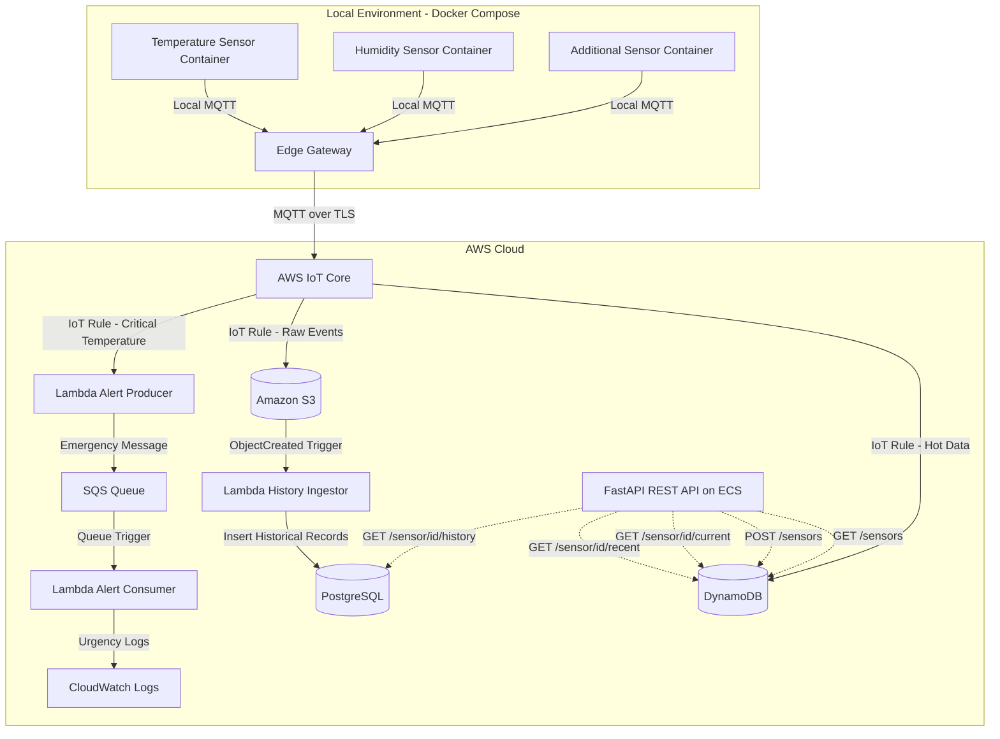

# IoT Edge Gateway Platform with AWS IoT Core, DynamoDB, S3, PostgreSQL, Lambda, SQS and ECS

This project implements a complete end-to-end IoT platform using the **Edge Gateway** pattern. It simulates multiple IoT sensors running locally in Docker containers, sends telemetry through a local MQTT gateway, forwards the data securely to **AWS IoT Core**, and processes it across several AWS services for real-time storage, historical persistence, alerting and API-based access.

The system combines local edge processing, cloud-based ingestion, serverless event processing, containerized backend services and Infrastructure as Code with Terraform.

---

## Overview

The platform is designed to simulate a production-style IoT architecture where sensor data is generated locally, routed through an edge gateway and then processed in the cloud.

Main capabilities:

* Simulate multiple sensors using Python containers.
* Publish sensor data through MQTT.
* Route local MQTT traffic through an Edge Gateway.
* Forward telemetry securely to AWS IoT Core using TLS certificates.
* Store recent sensor data in DynamoDB.
* Store raw event data in Amazon S3.
* Process historical data with AWS Lambda.
* Persist historical records in PostgreSQL.
* Expose sensor data through a FastAPI REST API.
* Deploy the API to AWS ECS.
* Detect critical temperature events with AWS IoT Rules.
* Send emergency alerts through Lambda and SQS.
* Register and query sensors through API endpoints.
* Provision the complete cloud infrastructure using Terraform modules.

---

## Architecture



---

## Tech Stack

### Local and Edge Layer

* Docker
* Docker Compose
* Python
* MQTT
* Edge Gateway container
* TLS certificates for AWS IoT Core communication

### Cloud Layer

* AWS IoT Core
* AWS DynamoDB
* Amazon S3
* AWS Lambda
* Amazon SQS
* Amazon ECS
* Amazon ECR
* Amazon CloudWatch Logs
* IAM
* VPC and networking resources

### Backend

* FastAPI
* Python
* DynamoDB service layer
* PostgreSQL service layer
* Dockerized API deployment

### Infrastructure

* Terraform
* Modular Terraform architecture
* Makefile automation
* Shell deployment scripts

---

## Main Components

### 1. Sensor Simulator

The `python_device` module contains the sensor simulator used to generate telemetry data. Each sensor runs as a Docker container and publishes data to the local MQTT gateway.

Relevant files:

```bash
python_device/
├── Dockerfile
├── requirements.txt
└── sensor_simulator.py
```

The simulator supports different sensor types such as temperature, humidity and additional configurable sensors.

Example payload:

```json
{
  "sensor_id": "sensor-temp-01",
  "type": "temperature",
  "value": 29.4,
  "unit": "C",
  "timestamp": "2026-06-14T20:15:00Z"
}
```

---

### 2. Edge Gateway

The `edge_gateway` module contains the Dockerized gateway responsible for forwarding local MQTT messages to AWS IoT Core.

Relevant files:

```bash
edge_gateway/
├── certs/
└── Dockerfile
```

The gateway uses TLS certificates generated and configured through the Terraform deployment process. It acts as the bridge between the local Docker-based sensor network and AWS IoT Core.

---

### 3. AWS IoT Core

AWS IoT Core receives the telemetry published by the Edge Gateway. IoT Rules are used to route messages to different cloud services depending on the type of processing required.

Implemented routing logic:

* Store real-time data in DynamoDB.
* Store raw JSON events in S3.
* Trigger emergency alert processing when critical temperature values are detected.

---

### 4. DynamoDB Hot Data Storage

DynamoDB is used as the hot data layer for fast reads and low-latency access to recent sensor events.

The API uses DynamoDB to:

* Register sensors.
* List sensors.
* Retrieve the current value of a sensor.
* Retrieve the most recent events of a sensor.

The DynamoDB integration is implemented in:

```bash
api/services/dynamodb.py
```

---

### 5. S3 Raw Event Storage

Amazon S3 stores the raw JSON events received from AWS IoT Core. This creates a durable cold data layer that preserves the original telemetry events before historical processing.

S3 also triggers the historical ingestion Lambda whenever a new object is created.

---

### 6. Historical Ingestion Lambda

The historical ingestion Lambda reads raw JSON files from S3 and inserts processed records into PostgreSQL.

Relevant files:

```bash
lambda_contents/
├── history_ingestor.py
├── psycopg2/
└── psycopg2_binary-2.9.12.dist-info/
```

Terraform also includes a deployable Lambda package under:

```bash
terraform/lambda/
├── history_ingestor.py
├── history_package/
└── lambda_function.py
```

This Lambda is triggered automatically by S3 object creation events.

---

### 7. PostgreSQL Historical Storage

PostgreSQL is used as the historical persistence layer. It stores processed telemetry records and supports long-term queries through the API.

The PostgreSQL service integration is implemented in:

```bash
api/services/postgres.py
```

This separation allows the platform to use DynamoDB for fast recent-data access and PostgreSQL for complete historical queries.

---

### 8. FastAPI REST API

The `api` module contains the REST API used to interact with the IoT platform.

Relevant files:

```bash
api/
├── Dockerfile
├── main.py
├── models.py
├── requirements.txt
└── services/
    ├── dynamodb.py
    └── postgres.py
```

The API exposes endpoints for sensor registration, real-time data, recent events and historical records.

Main endpoints:

```http
GET /sensors
```

Returns all registered sensors.

```http
POST /sensors
```

Registers a new sensor in the system.

```http
GET /sensor/{id}/current
```

Returns the latest value reported by a specific sensor.

```http
GET /sensor/{id}/recent
```

Returns the most recent events for a specific sensor.

```http
GET /sensor/{id}/history
```

Returns the historical records for a specific sensor from PostgreSQL.

---

### 9. Alert System with Lambda and SQS

The platform includes an emergency alert pipeline for critical sensor readings.

Relevant files:

```bash
lambda/
├── alert_consumer/
│   └── lambda_function.py
└── alert_producer/
    └── lambda_function.py
```

Alert flow:

1. A sensor publishes a temperature event.
2. AWS IoT Core evaluates the event using an IoT Rule.
3. If the temperature exceeds the configured threshold, the alert producer Lambda is triggered.
4. The alert producer sends an emergency message to SQS.
5. SQS triggers the alert consumer Lambda.
6. The alert consumer writes the emergency event to CloudWatch Logs.

Example IoT Rule condition:

```sql
SELECT * FROM 'sensors/+/data'
WHERE type = 'temperature' AND value > 35
```

Example alert message:

```json
{
  "level": "CRITICAL",
  "sensor_id": "sensor-temp-01",
  "message": "Critical temperature threshold exceeded",
  "value": 38.4,
  "timestamp": "2026-06-14T20:20:00Z"
}
```

---

## Repository Structure

```bash
.
├── api/
│   ├── Dockerfile
│   ├── main.py
│   ├── models.py
│   ├── requirements.txt
│   └── services/
│       ├── dynamodb.py
│       └── postgres.py
│
├── docker-compose.yml
│
├── edge_gateway/
│   ├── certs/
│   └── Dockerfile
│
├── python_device/
│   ├── Dockerfile
│   ├── requirements.txt
│   └── sensor_simulator.py
│
├── lambda/
│   ├── alert_consumer/
│   │   └── lambda_function.py
│   └── alert_producer/
│       └── lambda_function.py
│
├── lambda_contents/
│   ├── history_ingestor.py
│   ├── psycopg2/
│   └── psycopg2_binary-2.9.12.dist-info/
│
├── terraform/
│   ├── build_and_deploy.sh
│   ├── data.tf
│   ├── main.tf
│   ├── outputs.tf
│   ├── variables.tf
│   ├── Makefile
│   ├── lambda/
│   │   ├── history_ingestor.py
│   │   ├── history_package/
│   │   └── lambda_function.py
│   └── modules/
│       ├── compute/
│       ├── database/
│       ├── ecr/
│       ├── ecs/
│       ├── iot/
│       ├── lambda/
│       ├── networking/
│       ├── postgres/
│       ├── sqs/
│       └── storage/
│
├── ejemplo.json
├── FLUJO.md
├── MQTT.md
├── TUTORIAL_AGREGAR_LAMBDA.md
├── lambda_function.py
├── Makefile
└── README.md
```

---

## Infrastructure as Code

The cloud infrastructure is organized using Terraform modules. This makes the project easier to maintain, extend and deploy.

Terraform modules:

```bash
terraform/modules/
├── compute/
├── database/
├── ecr/
├── ecs/
├── iot/
├── lambda/
├── networking/
├── postgres/
├── sqs/
└── storage/
```

Each module is responsible for a specific part of the architecture:

* `iot`: AWS IoT Core resources, policies, certificates and rules.
* `database`: DynamoDB tables.
* `storage`: S3 buckets and event triggers.
* `lambda`: Lambda functions and permissions.
* `sqs`: Queue-based alert pipeline.
* `postgres`: PostgreSQL infrastructure.
* `ecr`: Docker image repository.
* `ecs`: API deployment on ECS.
* `networking`: VPC, subnets and networking configuration.
* `compute`: supporting compute resources.

---

## Getting Started

### Requirements

Before running the project, make sure the following tools are installed:

* Docker
* Docker Compose
* Terraform
* AWS CLI
* Make

AWS credentials must be configured locally, for example:

```bash
~/.aws/credentials
```

---

## Deployment

### 1. Deploy Cloud Infrastructure

From the root directory, run:

```bash
make aws-up
```

This provisions the AWS infrastructure using Terraform, including:

* AWS IoT Core resources.
* IoT certificates and policies.
* DynamoDB tables.
* S3 buckets.
* Lambda functions.
* SQS queue.
* PostgreSQL infrastructure.
* ECR repository.
* ECS service for the FastAPI backend.
* IAM roles and permissions.

---

### 2. Start Local Sensors and Edge Gateway

After the AWS infrastructure is ready, start the local containers:

```bash
make local-up
```

This starts the local IoT simulation environment using Docker Compose.

The local environment includes:

* Edge Gateway container.
* Temperature sensor container.
* Humidity sensor container.
* Additional sensor containers when configured.

---

### 3. View Live Logs

To inspect the running containers and verify the data flow:

```bash
make logs
```

This allows you to observe:

* Sensor data generation.
* MQTT publishing.
* Edge Gateway forwarding.
* Communication with AWS IoT Core.

---

## API Usage

Once the FastAPI service is deployed to ECS, the following endpoints can be used.

Replace `API_URL` with the deployed ECS API URL.

### List Sensors

```bash
curl http://API_URL/sensors
```

---

### Register a Sensor

```bash
curl -X POST http://API_URL/sensors \
  -H "Content-Type: application/json" \
  -d '{
    "sensor_id": "sensor-pressure-01",
    "type": "pressure",
    "unit": "Pa",
    "description": "Pressure sensor deployed from Docker Compose"
  }'
```

---

### Get Current Sensor Value

```bash
curl http://API_URL/sensor/sensor-temp-01/current
```

---

### Get Recent Sensor Events

```bash
curl http://API_URL/sensor/sensor-temp-01/recent
```

---

### Get Historical Sensor Records

```bash
curl http://API_URL/sensor/sensor-temp-01/history
```

---

## Local Docker Compose

The local simulation is managed through:

```bash
docker-compose.yml
```

This file defines the local containers for the sensors and the Edge Gateway.

The sensor simulator can be extended by adding new containers with different environment variables, allowing new sensor types to be tested without changing the cloud architecture.

---

## Documentation Files

The repository also includes additional documentation:

```bash
FLUJO.md
```

Describes the complete data flow of the system.

```bash
MQTT.md
```

Explains the MQTT communication model used by the sensors and the Edge Gateway.

```bash
TUTORIAL_AGREGAR_LAMBDA.md
```

Documents how to add and integrate additional Lambda functions into the system.

```bash
ejemplo.json
```

Provides an example event payload for testing and validation.

---

## Cleanup

To stop local containers and destroy the AWS resources created by Terraform:

```bash
make clean
```

This command removes:

* Local Docker containers.
* Docker networks.
* Generated local files.
* Terraform-managed AWS resources.
* Temporary certificates and deployment artifacts.

---

## Project Results

This project demonstrates a complete IoT cloud architecture with a clear separation between edge simulation, cloud ingestion, real-time access, historical persistence and event-driven alerting.

Key results:

* Implemented an Edge Gateway architecture using Docker and MQTT.
* Connected local sensor containers to AWS IoT Core using TLS.
* Routed telemetry to DynamoDB and S3 through IoT Rules.
* Built a historical ingestion pipeline from S3 to PostgreSQL using Lambda.
* Created an alert pipeline using IoT Rules, Lambda, SQS and CloudWatch Logs.
* Developed a FastAPI backend for sensor registration and data access.
* Deployed the API as a containerized service on ECS.
* Automated cloud infrastructure provisioning with Terraform modules.
* Designed the system to be extensible for new sensor types.

---

## Skills Demonstrated

* IoT architecture design.
* MQTT communication.
* Edge Gateway pattern.
* AWS IoT Core integration.
* Serverless processing with AWS Lambda.
* Queue-based event processing with SQS.
* NoSQL data modeling with DynamoDB.
* Relational historical storage with PostgreSQL.
* REST API development with FastAPI.
* Docker-based service deployment.
* ECS deployment.
* Infrastructure as Code with Terraform.
* Cloud automation with Makefile scripts.

---

## Author

**Juan Diego Collazos Mejía**
Systems and Computing Engineering
Pontificia Universidad Javeriana Cali

---

## Status

Completed portfolio project focused on IoT, cloud architecture, backend development, serverless processing and Infrastructure as Code.
